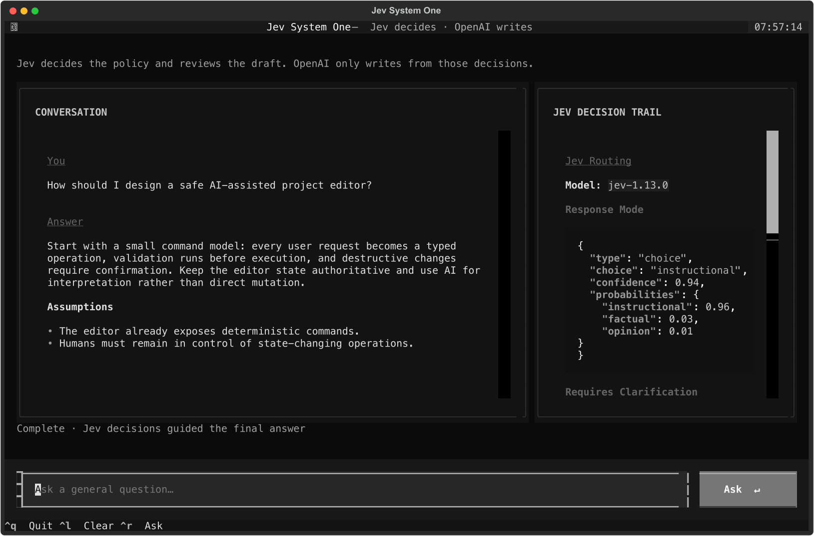
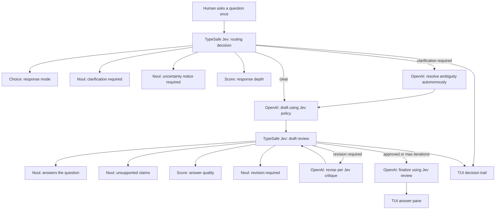

<div align="center">

# Jev System One

### Ask in plain English. Get an answer. See the decisions behind it.

[](https://github.com/haseeb-heaven/jev-system-one/actions/workflows/ci.yml)
[](https://www.python.org/)
[](https://typesafe.ai/)
[](LICENSE)

A polished terminal interface where OpenAI generates useful answers and TypeSafe Jev independently evaluates their relevance, reliability, and quality.

</div>



## How it works

```text
Plain-English question (Human involved once)
        ↓
[LangGraph] Jev decides response mode, clarification, uncertainty, and depth
        ↓ (if clarification required) → OpenAI resolves ambiguities autonomously
        ↓
[LangGraph] OpenAI drafts from Jev's decision
        ↓
[LangGraph] Jev reviews and scores the draft
        ↓ (if revision required) ↺ OpenAI revises per Jev critique (autonomous loop)
        ↓
[LangGraph] OpenAI finalizes from Jev's review
        ↓
The TUI presents the answer and decision report side by side
```

## Jev as the decision engine with LangGraph

[TypeSafe](https://typesafe.ai/) System One models are designed for fast, structured software decisions. [Jev](https://docs.typesafe.ai/concepts/system-one) is the authority for response policy and quality review; it returns typed judgments, probabilities, and confidence. OpenAI never classifies the request or sets the policy—it only drafts, revises, and finalizes wording from Jev's decisions.

Orchestrated using **LangGraph**, the pipeline ensures the human user is involved only once. If Jev flags that a question requires clarification, or that a draft requires revision, LangGraph routes internally to OpenAI to resolve ambiguities and refine the draft without interrupting the user:



Jev makes typed decisions at two points in every request:

| Decision | Primitive | What it measures |
| --- | --- | --- |
| Response mode | Choice | Factual, instructional, creative, opinion, or clarification |
| Clarification / uncertainty | Noul | Probability that a follow-up or explicit uncertainty notice is required |
| Response depth | Score | Brief, standard, or detailed answer policy |
| Answers the question | Noul | Probability that the draft directly addresses the request |
| Unsupported claims | Noul | Probability that uncertain claims are presented as facts |
| Answer quality | Score | Usefulness and completeness on an ordered four-level rubric |
| Revision required | Noul | Probability that OpenAI should materially revise the draft |

The report includes probabilities, confidence, model version, token usage, and the TypeSafe request ID.

## Features

- Full-screen Textual interface with responsive answer and decision panes
- Animated Jev → OpenAI → Jev → OpenAI processing state and progress bar
- Mouse wheel, two-finger trackpad, and draggable scrollbar support
- A clean current-question view that replaces stale results
- Non-interactive mode for scripts and shell workflows
- Explicit retries, timeouts, structured errors, and safe credential handling
- Automated linting and tests on GitHub Actions

## Quick start

```bash
git clone https://github.com/haseeb-heaven/jev-system-one.git
cd jev-system-one
python3 -m venv .venv
source .venv/bin/activate
pip install -e .
```

Create `.env` in the project root:

```dotenv
JEV_API_KEY=your_jev_api_key
OPENAI_API_KEY=your_openai_api_key
JEV_MODEL=jev-latest
LLM_MODEL=gpt-4o-mini
LOG_LEVEL=INFO
```

You can start from the checked-in template:

```bash
cp .env.example .env
```

Launch the interactive interface:

```bash
jev
```

Ask one question without opening the full-screen interface:

```bash
jev ask "How should I design a safe AI-assisted project editor?"
```

## Controls

| Input | Action |
| --- | --- |
| `Enter` or **Ask** | Submit the question |
| Mouse wheel / two-finger gesture | Scroll the pane under the pointer |
| Drag the cyan scrollbar | Move through long answers or reports |
| `Ctrl+R` | Focus the question input |
| `Ctrl+L` | Clear the current result |
| `Ctrl+Q` | Quit |

## Project layout

```text
src/jev_system_one/
├── cli.py             # TUI launcher and one-shot command
├── config.py          # Environment configuration
├── jev.py             # Official TypeSafe SDK integration
├── llm.py             # OpenAI structured answer generation
├── logging_setup.py   # Application and SDK logging
├── tui.py             # Textual interface and background workers
└── workflow.py        # Jev → OpenAI → Jev → OpenAI orchestration
```

The TypeSafe integration uses the official Python SDK with `TypeSafeClient`, `Choice`, `Noul`, `Score`, and `RetryPolicy`.

## Development

```bash
source .venv/bin/activate
pytest -q
ruff check .
```

Regenerate the interface screenshot after a visual change:

```bash
python scripts/capture_tui.py
rsvg-convert -o docs/tui-preview.png docs/tui-preview.svg
```

`master` contains the latest stable state. `develop` is the integration branch for ongoing work.

## Security

`.env` is ignored by Git. Never commit API keys, tokens, request payloads containing private data, or debug logs with sensitive content.

## License

[MIT](LICENSE)
